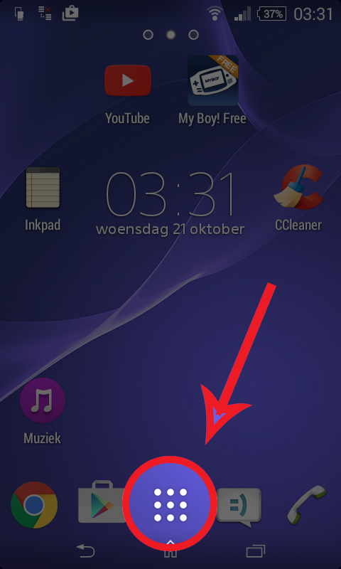

# Troelant
Drankenlijst voor het jeugdhuis Joc Troelant

## Instalatie (android devices only)

### QR Reader

Een QR Reader is de makkelijkste manier om een niet app store app te installeren. Een QR reader's kun je gratis vinden in de app store:

### Onbekende Bronnen Toelaten

Voor de installatie van een niet app store app moet je een bepaalde instelling tijdelijk afzetten:

